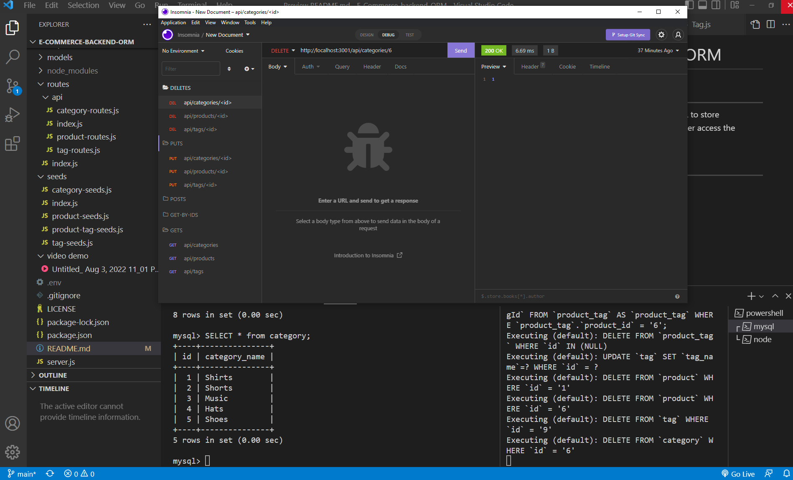

# E-Commerce-backend-ORM

### Short Description
___
This backend javascript application uses MySQL to store ecommerce fields and data, and allows developer access the database via API calls.

### Video Demonstration 
___
[demo video](./assets/video%20demo/Untitled_%20Aug%203%2C%202022%2011_01%20PM.webm/)

### Screenshot
___
